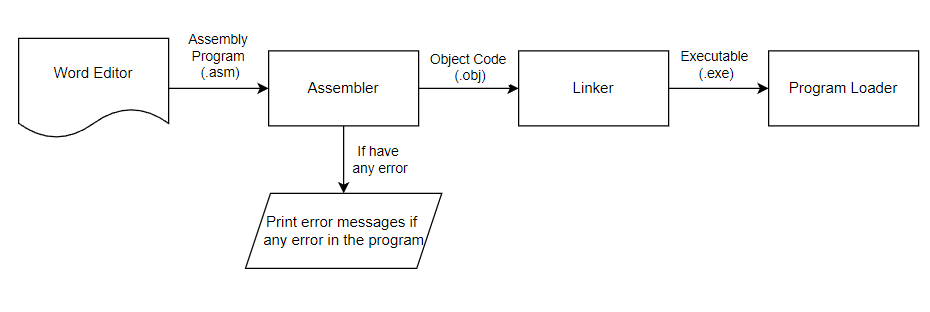
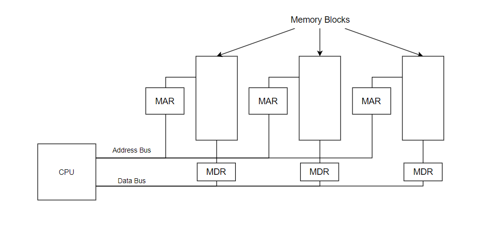

# AACS3064 JAN 2023 Answers

[Link to the paper](https://eprints.tarc.edu.my/23982/1/AACS3064.pdf)

- [Question 1](#question-1)
- [Question 2](#question-2)
- [Question 3](#question-3)
- [Question 4](#question-4)

## Answers

### Question 1

a) i)

- Convert each digit to binary representation
  - A<sub>16</sub> = 1010<sub>2</sub>
  - 8<sub>16</sub> = 1000<sub>2</sub>
  - F<sub>16</sub> = 1111<sub>2</sub>
  - E<sub>16</sub> = 1110<sub>2</sub>
  - Result: 1010 1000 . 1111 1110<sub>2</sub>
- Group the digits into triplets: 010 101 000 . 111 111 100<sub>2</sub>
- Convert each triplet to octal digit
  - 010<sub>2</sub> = 3<sub>8</sub>
  - 101<sub>2</sub> = 5<sub>8</sub>
  - 000<sub>2</sub> = 0<sub>8</sub>
  - 111<sub>2</sub> = 7<sub>8</sub>
  - 111<sub>2</sub> = 7<sub>8</sub>
  - 100<sub>2</sub> = 4<sub>8</sub>

Answer : 350.774<sub>8</sub>

ii)

- Separate number into integer component [1011] and decimal component [0.11]
- Integer component
  1011 ÷ 16 = 63 remainder 3

  63 ÷ 16 = 3 remainder 15(F)

  3 ÷ 16 = 0 remainder 3

  Integer part: 3F3<sub>16</sub>
  
- Decimal component
  0.11 × 16 = 1 + 0.76
  
  0.76 × 16 = 12(C) + 0.16
  
  0.16 x 16 = 2 + 0.56
  
  0.56 × 16 = 8 + 0.96

  0.96 × 16 = 15(F) + 0.36

  Decimal Part: 1C29...<sub>16</sub>

Answer : 3F3.1C29...<sub>16</sub>

iii)

2 × 3<sup>1</sup> + 2 × 3<sup>0</sup> + 2 × 3<sup>-1</sup> + 2 × 3<sup>-2</sup>

= 6 + 2 + 0.6667... + 0.2222...

= 8.8889...<sub>10</sub>

iv)

- Convert to decimal

  6 × 7<sup>1</sup> + 5 × 7<sup>0</sup>

  = 42 + 5

  = 47<sub>10</sub>

- Convert to binary

  47 ÷ 2 = 23 remainder 1

  23 ÷ 2 = 11 remainder 1

  11 ÷ 2 = 5 remainder 1

  5 ÷ 2 = 2 remainder 1

  2 ÷ 2 = 1 remainder 0

  1 ÷ 2 = 0 remainder 1

Answer: 101111<sub>2</sub>

b)

- Convert each number into 8-bit binary
  - -121<sub>10</sub> = -0111 1001<sub>2</sub>

    121 ÷ 2 = 60 remainder 1

    60 ÷ 2 = 30 remainder 0

    30 ÷ 2 = 15 remainder 0

    15 ÷ 2 = 7 remainder 1

    7 ÷ 2 = 3 remainder 1

    3 ÷ 2 = 1 remainder 1

    1 ÷ 2 = 0 remainder 1

  - -9<sub>10</sub> = -0000 1001<sub>2</sub>

    9 ÷ 2 = 4 remainder 1

    4 ÷ 2 = 2 remainder 0

    2 ÷ 2 = 1 remainder 0

    1 ÷ 2 = 0 remainder 1

- Apply two's complements to each number
  - -121<sub>10</sub>
    - Flip all bits: 0111 1001 => 1000 0110
    - Add one: 1000 0110 + 1 = **1000 0111**
  - -9<sub>10</sub>
    - Flip all bits: 0000 1001 => 1111 0110
    - Add one: 1111 0110 + 1 = **1111 0111**

- Add the values

   ```
        1000 0111
    +   1111 0111
   ---------------
      1 0111 1110
   ```

   Carry is ignored, answer = 0111 1110

- Verify the answer
  - -121<sub>10</sub> + (-9<sub>10</sub>) = -130<sub>10</sub>
  - Binary answer is positive, no need to apply two's complement
  - Get the binary value in decimal

    1 × 2<sup>6</sup> + 1 × 2<sup>5</sup> + 1 × 2<sup>4</sup> + 1 × 2<sup>3</sup> + 1 × 2<sup>2</sup> + 1 × 2<sup>1</sup>

    = 64 + 32 + 16 + 8 + 4 + 2

    = (-)126<sub>10</sub>

- The answer is not correct because the value of -130 exceeds the 8-bit signed binary representable range [-128, 127]
- The answer generates carry and overflow

c) i)

- Adjust the exponent: -0.54321 × 10<sup>1</sup>
- Get the mantissa: 54321
- Get the exponent in excess-48
  - 48 + 1 = 49
- Get the sign: Negative => 9

Answer: 9 49 54321

ii)

- Adjust the exponent
  ```
     9 49 022222
   + 9 49 11111
  ---------------
  ```

- Add the mantissa

  -0.022222 + (-0.11111) = -0.13333 (round to 5 digits)

- Prepend the sign and exponent: **9 49 13333**

d)

- Get the sign: 1 => Negative (-)
- Get the exponent of excess-127 notation in decimal
  
  1 × 2<sup>6</sup> + 1 × 2<sup>5</sup> + 1 × 2<sup>4</sup> + 1 × 2<sup>3</sup> + 1 × 2<sup>2</sup> + 1 × 2<sup>0</sup>

  = 64 + 32 + 16 + 8 + 4 + 1

  = 125

- Reverse the excess-127 calculation: 125 - 127 = -2
- Show value in exponent: 1.111<sub>2</sub> × 2<sup>-2</sub>
> REMEMBER THE IMPLICIT LEADING BIT
- Adjust the exponent: 0.01111<sub>2</sub>
- Convert back to decimal

  1 × 2<sup>-2</sup> + 1 × 2<sup>-3</sup> + 1 × 2<sup>-4</sup> + 1 × 2<sup>-5</sup>

  = 0.25 + 0.125 + 0.0625 + 0.03125

  = **0.46875<sub>10</sub>**

### Question 2

a) 

- Little-endian byte ordering stores the value in increasing significance, which means the least significant byte first
- Big-endian byte ordering stores the value in decreasing significance, which means the most significant byte first.

- The value is stored using little-endian byte ordering
- The value is split into 4 bytes : 5A 6B 7C 8D<sub>16</sub>
- The right-most byte which is the least significant byte, is stored into the memory first
- The consecutive bytes are stored into the memory cells from right to left

  ```
          -------------------------------------
  Memory  |   8D   |   7C   |   6B   |   5A   |
          -------------------------------------
  Address   0x2348   0x2349   0x234A   0x234B
  ```

b)

- Strength
  - Has a wide range of instructions, able to perform complex processing which suits systems such as server
  - Able to use less instruction to perform tasks because each instruction consists of many steps
- Weakness
  - Has variable instruction word size, the processor needs a longer time to interpret the instruction before performing the tasks
  - Has fewer general-purpose registers to hold more actively used data and instruction, which increases the memory access that is slower compared to register access
 
c)

- PC passes the current instruction address to MAR. The address is decoded and the value is stored in MDR.
- MDR passes the instruction on to IR to decode it.
- MAR is loaded with the address decoded from IR which locates the address that the CPU want to interact with.
- CPU can either fetch the data by passing the value from MDR into the accumulator or store the data by passing the value in the accumulator back into the MDR

d)

Assembly Code | Machine Code
-|-
Higher-level language | Low-level language
Easier to understand and debug | Hard to read, write and debug
Requires translation to be understood by the CPU | Requires no translation because it is already machine-readable

### Question 3

a) 

b) 

- Memory interleaving allows the CPU to access different parts of memory simultaneously, which increases the overall efficiency.

c) 

- DMA
  - Allow the I/O device to bypass the CPU and perform read/write to the memory
  - Able to transfer blocks-data without involving machine cycle for every word transferred.
  - Relieves the CPU from I/O operation
- Interrupt
  - Device able to communicate with the CPU to request for service
  - CPU doesn't need to constantly poll the devices to know if they need attention to perform tasks
  - CPU can quickly react if an interrupt indicates an abnormal event such as power failure happened.

d)

```
MOV CX, 4
MOV DL, 32H
L1:
  MOV AH, 02H
  INT 21H
  INC DL
  LOOP L1
```

### Question 4

a) i) 

```
> R CS
> 1A2B
```

ii) `E 200 88D82C34`

iii) 

```
A 1001:6
MOV AL, 0C
MOV BL, 0A
MUL BL
```

b) AL = 03, BL = 9A, CL = 23, DL = 8A

c)

- CS
  8888 H x 10 H = 88880 H
- DS
  9999 H x 10 H = 99990 H

d) i)

```assembly
PROMPT DB "Enter a character (a-z or A-Z): $"
UPPERCASE_MSG DB "You have entered an uppercase $"
LOWERCASE_MSG DB "You have entered a lowercase character."
```

ii)

```assembly
MOV AX, @DATA
MOV DS, AX
```

iii)

```assembly
LEA DX, PROMPT
MOV AH, 09H
INT 21H
```

iv)

```assembly
MOV AH, 01H
INT 21H
```

v)

```assembly
CMP AL, "A"
JB invalid_input
CMP AL, "Z"
JBE is_uppercase
CMP AL, "a"
JB invalid_input
CMP AL, "z"
JBE is_lowercase
```

vi)

```assembly
is_uppercase:
  LEA DX, UPPERCASE_MSG
  MOV AH, 09H
  INT 21H
  JMP terminate

is_lowercase:
  LEA DX, LOWERCASE_MSG
  MOV AH, 09H
  INT 21H
  JMP terminate
```

vii)

```assembly
terminate:
  MOV AX, 4C00H
  INT 21H
```
