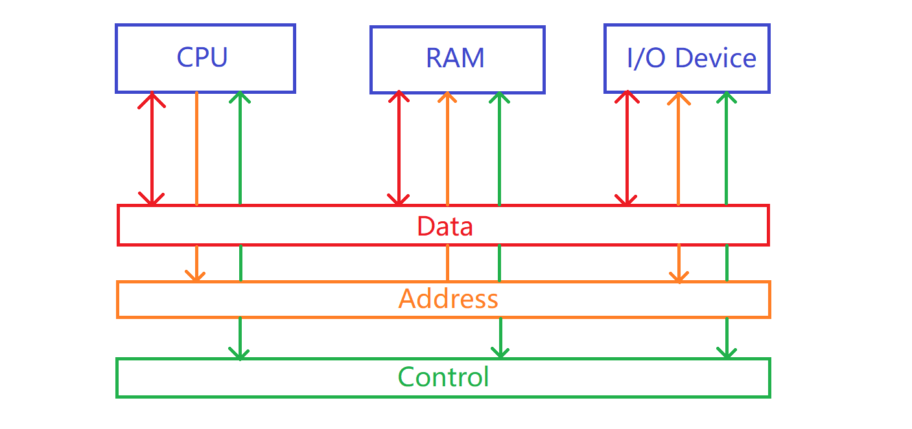

# AACS3064 OCT 2023 Answers

[Link to the paper](https://eprints.tarc.edu.my/26849/1/AACS3064.pdf)

- [Question 1](#question-1)
- [Question 2](#question-2)
- [Question 3](#question-3)
- [Question 4](#question-4)

## Answers

### Question 1

a) i)

- Convert each digit to binary representation

  - F<sub>16</sub> => 1111<sub>2</sub>
  - D<sub>16</sub> => 1101<sub>2</sub>
  - A<sub>16</sub> => 1010<sub>2</sub>
  - C<sub>16</sub> => 1100<sub>2</sub>

- FD.AC<sub>16</sub> = 1111 1101 . 1010 1100<sub>2</sub>

- Group digits into triplets => 011 111 101 . 101 011<sub>2</sub>

- Convert each triplet into octal representation

  - 011<sub>2</sub> => 3<sub>8</sub>
  - 111<sub>2</sub> => 7<sub>8</sub>
  - 101<sub>2</sub> => 5<sub>8</sub>
  - 101<sub>2</sub> => 5<sub>8</sub>
  - 011<sub>2</sub> => 3<sub>8</sub>

- Answer: 375.53<sub>8</sub>

ii)

- Separate into integer component [1234] and decimal component [0.56]
- Integer component

  1234 ÷ 16 = 77 remainder 2

  77 ÷ 16 = 4 remainder 13 (D)

  4 ÷ 16 = 0 remainder 4

  4D2<sub>16</sub>

- Decimal component

  0.56 × 16 = 8 + 0.96
  
  0.96 × 16 = 15(F) + 0.36
  
  0.36 × 16 = 5 + 0.76
  
  0.76 × 16 = 12(C) + 0.16
  
  0.16 × 16 = 2 + 0.56

  8F5C2<sub>16</sub>

- Answer: 4D2.8F5C2...<sub>16</sub>

iii) 

4 × 5<sup>1</sup> + 1 × 5<sup>0</sup> + 4 × 5<sup>-1</sup> + 2 × 5<sup>-2</sup>

= 20 + 1 + 0.8 + 0.08

= 21.88<sub>10</sub>

iv)

- Group digits into quadruplets => 0110 1010 . 1010<sub>2</sub>
- Convert each number into hexadecimal representation
  - 0110<sub>2</sub> = 6<sub>16</sub>
  - 1010<sub>2</sub> = A<sub>16</sub>
  - 1010<sub>2</sub> = A<sub>16</sub>

Answer: 6A.A<sub>16</sub>

b)

- Convert numbers into binary representation
  - -127<sub>10</sub> = -0111 1111<sub>2</sub>

    127 ÷ 2 = 63 remainder 1
    
    63  ÷ 2 = 31 remainder 1
    
    31  ÷ 2 = 15 remainder 1
    
    15  ÷ 2 = 7 remainder 1
    
    7  ÷ 2 = 3 remainder 1
    
    3  ÷ 2 = 1 remainder 1
    
    1  ÷ 2 = 0 remainder 1

  - -1<sub>10</sub> = -0000 0001<sub>2</sub>

    1  ÷ 2 = 0 remainder 1

- Apply two's complement onto the negative numbers
  - -127<sub>10</sub>
    - Flip all bits : 0111 1111 => 1000 0000
    - Add one: 1000 0000 + 1 = 1000 0001
  - -1<sub>10</sub>
    - Flip all bits : 0000 0001 => 1111 1110
    - Add one: 1111 1110 + 1 = 1111 1111

- Add the numbers
  ```
       1000 0001
   +   1111 1111
  ---------------
     1 1000 0000
  ```

  Carry is ignored. Answer : 1000 0000

- Verify the answer

  -127<sub>10</sub> + (-1<sub>10</sub>) = -128<sub>10</sub>

  For the binary value calculated above, apply two's complement to get the decimal representation
  
  - Flip all bits : 1000 0000 => 0111 1111
  - Add one : 1000 0000

    1 × 2<sup>7</sup> = 128<sub>10</sub>

  - Prepend negative sign : -128<sub>10</sub>

- The answer is within the 8 bit binary representable range, hence the answer is valid. The answer produces carry, but it doesn't overflow.

c) i)

- Provide zero exponent : -0.0099999 × 10<sup>0</sup>
- Adjust the exponent: 0.99999 × 10<sup>-2</sup>
- Get the exponent in excess-50 notation
  50 + (-2) = 48
- Get the mantissa: 99999
- Get the sign: Negative => 9

Answer: 9 48 99999

ii)

- Multiply the mantissa
  0.12345 × 0.54321 = 0.067059 = 0.67059 × 10<sup>-1</sup>
- Add the exponent and minus 50
  48 + 49 - 50 = 47
- Adjust back the excess-50 exponent and add it to the result
  47 - 50 = -3
  
  -1 + (-3) = -4
  
  0.67059 × 10<sup>-4</sup>
- Multiply the mantissa with exponent
  0.000067059  
- Get the sign
  (+) × (-) = (-)

Answer: -0.000067059

d)

- Separate the number into integer component [87<sub>10</sub>] and decimal component [0.125<sub>10</sub>]
- Convert each to binary representation
  - 87<sub>10</sub> = 101 0111<sub>2</sub>

    87 ÷ 2 = 43 remainder 1
    
    43  ÷ 2 = 21 remainder 1
    
    21  ÷ 2 = 10 remainder 1
    
    10  ÷ 2 = 5 remainder 0
    
    5  ÷ 2 = 2 remainder 1
    
    2  ÷ 2 = 1 remainder 0
    
    1  ÷ 2 = 0 remainder 1

  - 0.125<sub>10</sub> = 0.001<sub>2</sub>

    0.125 × 2 = 0 + 0.25
    0.25 × 2 = 0 + 0.5
    0.5 × 2 = 1 + 0.0

- Combine the values: + 101 0111.001<sub>2</sub>
- Provide zero exponent : 101 0111.001 × 2<sub>0</sub>
- Adjust the exponent : 1.0101 1100 1 × 2<sub>6</sub>
- Get the mantissa (23 bits) : 0101 1100 1000 0000 0000 000
- Find the exponent in excess-127
  127 + 6 = 133
- Convert exponent to binary
  
  133 ÷ 2 = 66 remainder 1
    
  66  ÷ 2 = 33 remainder 0
    
  33  ÷ 2 = 16 remainder 1
    
  16  ÷ 2 = 8 remainder 0
    
  8  ÷ 2 = 4 remainder 0
    
  4  ÷ 2 = 2 remainder 0
    
  2  ÷ 2 = 1 remainder 0

  1 ÷ 2 = 0 remainder 1

  Exponent: 1000 0101<sub>2</sub>

- Get the sign

  Positive => 0

Answer: 0 1000 0101 0101 1100 1000 0000 0000 000<sub>2</sub>

### Question 2

a)

PC -> MAR ; MAR = 0236

MDR -> IR ; IR = 5458

IR<sub>[address]</sub> -> MAR ; MAR = 0458

MDR + A -> A ; A = 0012 + 146C = 147E

PC + 2 -> PC ; PC = 0238

PC -> MAR ; MAR = 0238

MDR -> IR ; IR = 845A

IR<sub>[address]</sub> -> MAR ; MAR = 045A

A -> MDR ; MDR = 147E

PC + 2 -> PC ; PC = 023A

b)

- Consists of many instructions, making the CPU capable carry out large variety of tasks, but most are not frequently used
- Each instruction could be very complex due to performing multiple tasks, which takes up execution time
- Instruction format has variable length, adding complexity to interpreting the instruction
- Has large amount of addressing mode to aid different needs of each instruction.

c) Data Segment, Code Segment, Stack Segment, Extra Segment

d) Generating object file involves compiling source code from human readable code, such as high-level language or mnemonic, into binary machine code. The machiine code is machine readable, hence the machine can directly uses the machine code to carry out appropriate instruction.

### Question 3

a) 



b)

Tightly Coupled System | Loosely Coupled System
-|-
Is multiprocessor system | Is multicomputer system
Mutliple CPU shares meory and I/O facilities | Each CPU has its own memory and I/O facilities
No communication channels between CPU | Has communication channels to synchronize
One CPU failure cause entire system failure | CPU are independent of each other, so one's failure won't cause the whole to fail

c)

- Direct Memory Access
  - I/O module has read/write access to the memory directly, bypassing the CPU
  - CPU send information such as disk address, memory address and size to the I/O module to initialise DMA
  - I/O module can write onto the memory directly, and send interrupt in the end to signal the completion of data transfer to CPU
- Interrupt
  - Unexpected commands that requires immediate attention of CPU to handle
  - When CPU receives interrupt, it completes the current instruction and push all registers into Program Control Block (PCB), then jump to the interrupt service to perform the instructions
  - Upon completion, it restores the registers and program counter then resume with the process
 
d) 

i) View memory content: D, View register content: R

ii) "A" enters assembly code into memory, and "E" enters machine code into memory

e) 

> This question is weird, might be error, might be not, I'll provide two set of answers.

```
if (i < 1 && i > 5) {
  print 'A'
}
```

```assembly
CMP i, 1
JGE skip
CMP i, 5
JLE skip
MOV AH, 2
MOV DL, 'A'
INT 21H

skip:
  ; ...
```

```
if (i > 1 && i < 5) {
  print 'A'
}
```

```assembly
CMP i, 1
JLE skip
CMP i, 5
JGE skip
MOV AH, 2
MOV DL, 'A'
INT 21H

skip:
  ; ...
```

### Question 4

a)

- Line 4: AL = CC
- Line 5: CL = 4A
- Line 6: BL = 33 >> 1 = 0011 0011 >> 1 = 0001 1001 = 19
- Line 7: 4A & 19 = 0100 1010 & 0001 1001 = 0000 1000 = 8

b)

- Convert the CS into 20 bit representation
  - 56600 H
- Add IP
  ```
     56600 H
   +  023F H
  -----------
     5683F H
  ```

Answer: 5683F H

c)

> Only write the pieces of code is enough, showing the full code is for those who want to test run the program

```assembly
.MODEL SMALL
.STACK 100H
.DATA
  VOWEL DB "aeiouAEIOU", 0
  COUNT DB ?

  ; (i) ------------------
  PROMPT DB "Enter a word: $"
  RESULT DB "Vowel count: $"
  ; (i) ------------------

  ; (ii) -----------------
  INPUT LABEL BYTE
  MAX_LEN DB 20
  ACT_LEN DB ?
  BUFFER DB 20 DUP ("$")
  ; (ii) -----------------

.CODE
.386

MAIN PROC FAR

  ; (iii) ----------------
  MOV AX, @DATA
  MOV DS, AX
  ; (iii) ----------------

  ; (iv) -----------------
  LEA DX, PROMPT
  MOV AH, 09H
  INT 21H
  ; (iv) -----------------

  ; (v) ------------------
  LEA DX, INPUT
  MOV AH, 0AH
  INT 21H
  ; (v) ------------------

  ; (vi) -----------------
  MOVZX CX, ACT_LEN ; loop for the length of input times
  MOV BX, 0 ; initialise index to zero, bx points to the index of input
  MOV DL, 0 ; DL stores the vowel count
  L1:
    MOV AL, BUFFER[BX] ; AL store the current character from input
    LEA DI, VOWEL ; initialise DI to point to the first vowel
    L2:
      CMP BYTE PTR [DI], 0 ; check DI points to end of VOWEL string
      JE END_L2   ; end the loop IF true
      CMP [DI], AL ; check if the character is the vowel point by DI
      JNE NOT_MATCH ; handle if not match
      INC DL ; else match, increment vowel count
      JMP END_L2 ; end the loop

      NOT_MATCH: 
        INC DI ; make DI point to the next vowel and proceed with matching
        JMP L2 ; jump back L2

    END_L2:
    INC BX
    LOOP L1 ; jump back L1

  MOV COUNT, DL
  ; (vi) ------------------

  MOV DL, 0DH ; Print Carriage Return
  MOV AH, 2
  INT 21H

  MOV DL, 0AH ; Print Line Feed
  MOV AH, 2
  INT 21H

  ; (vii) -----------------
  LEA DX, RESULT
  MOV AH, 09H
  INT 21H

  MOV DL, COUNT
  ADD DL, 30H
  MOV AH, 2
  INT 21H
  ; (vii) -----------------

  ; (viii) ----------------
  MOV AX, 4C00H
  INT 21H
  ; (viii) ----------------

MAIN ENDP

END MAIN
```
